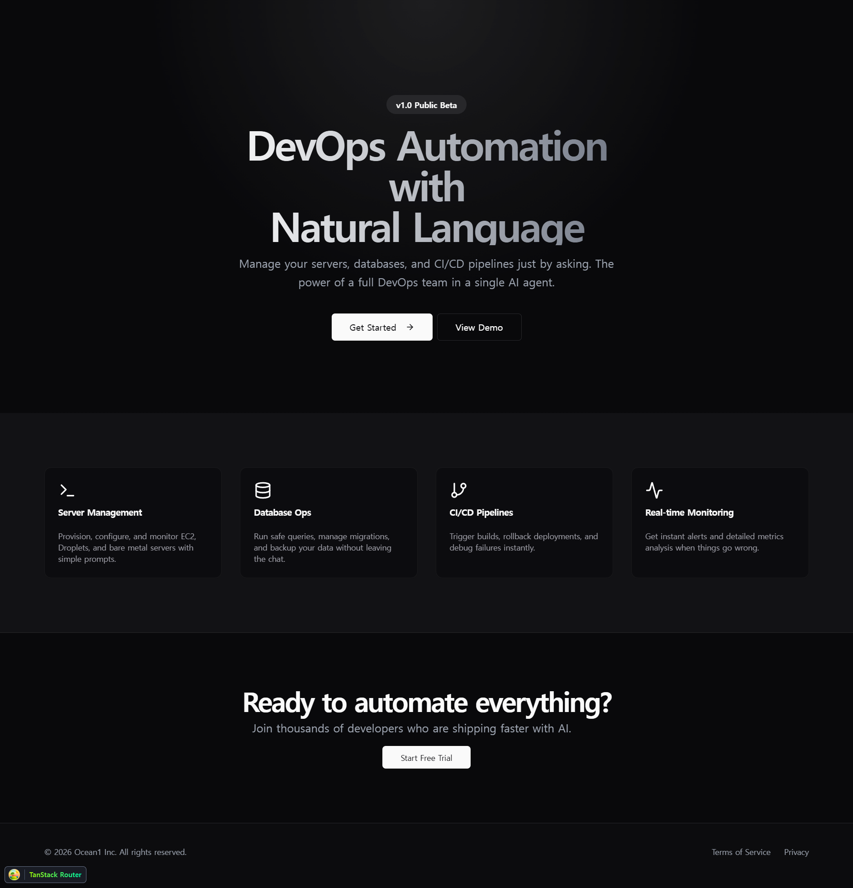
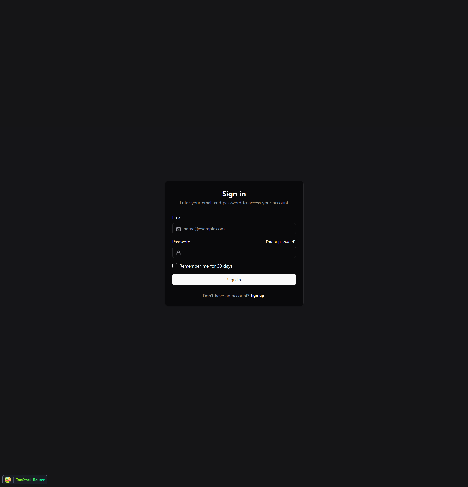
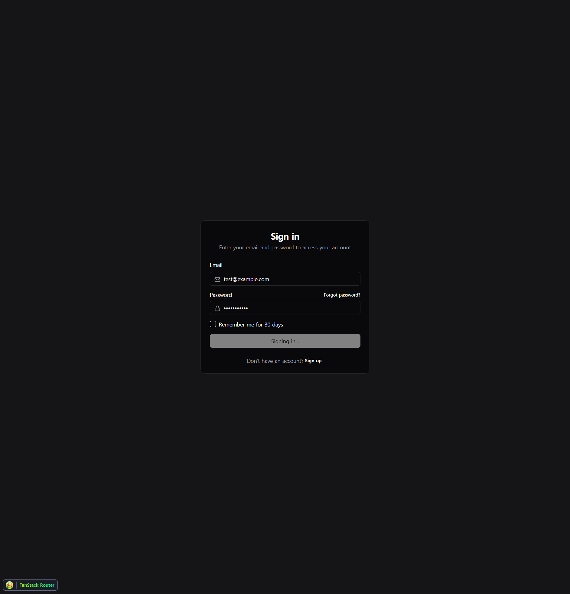
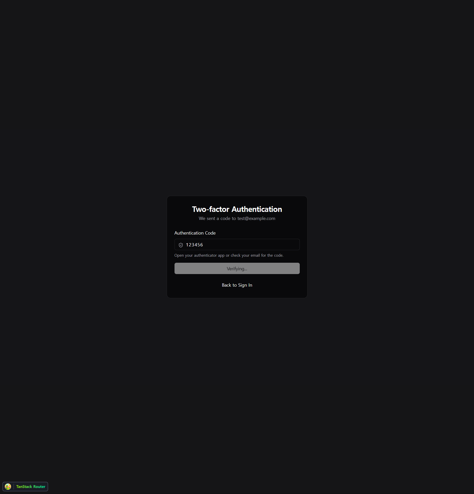
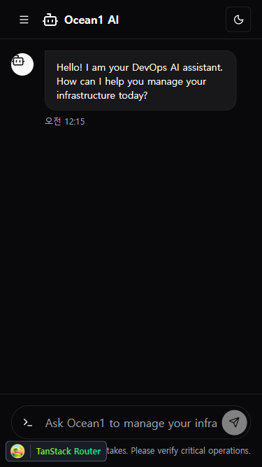

# 개발 일지 - 2026년 2월 1일 (v1)

## 🚀 프로젝트 시작: AI DevOps Automation Tool

오늘은 AI 기반 DevOps 자동화 도구의 첫 걸음을 내디뎠습니다.
Monorepo 환경을 구축하고, 주요 UI 페이지의 프로토타입을 구현했습니다.

### 🛠 기술 스택 (Tech Stack)

*   **Runtime & Manager**: Bun
*   **Architecture**: Monorepo (Bun Workspaces)
*   **Frontend**: React 18 + Vite + TypeScript
*   **Routing**: TanStack Router
*   **Styling**: TailwindCSS + shadcn/ui
*   **Theme**: Dark Mode Default (Vercel Style)

---

## 🎨 구현 내용 (UI Prototype)

### 1. 랜딩 페이지 (Landing Page)
프로젝트의 첫 인상을 결정하는 랜딩 페이지입니다. Vercel 스타일의 그라데이션과 깔끔한 Grid 레이아웃을 적용했습니다.

### 2. 로그인 및 MFA (Authentication)
보안을 고려하여 2단계 인증(MFA) 흐름을 UI로 구현했습니다.

**로그인 화면:**

**MFA 입력 화면:**

### 3. AI 채팅 인터페이스 (Main App)
사용자가 AI와 소통하며 인프라를 관리하는 핵심 인터페이스입니다.
Claude Code 스타일을 참고하여 사이드바와 채팅 영역을 구성했고, 모바일 환경에서는 Drawer 형태로 변형되도록 반응형으로 구현했습니다.

**데스크톱 뷰:**

**모바일 뷰 (사이드바 열림):**

---

## 📝 다음 단계 (Next Steps)
*   백엔드 서버 구축 (Hono 또는 ElysiaJS 검토)
*   실제 LLM API 연동
*   인프라 제어 명령 실행 모듈 개발
