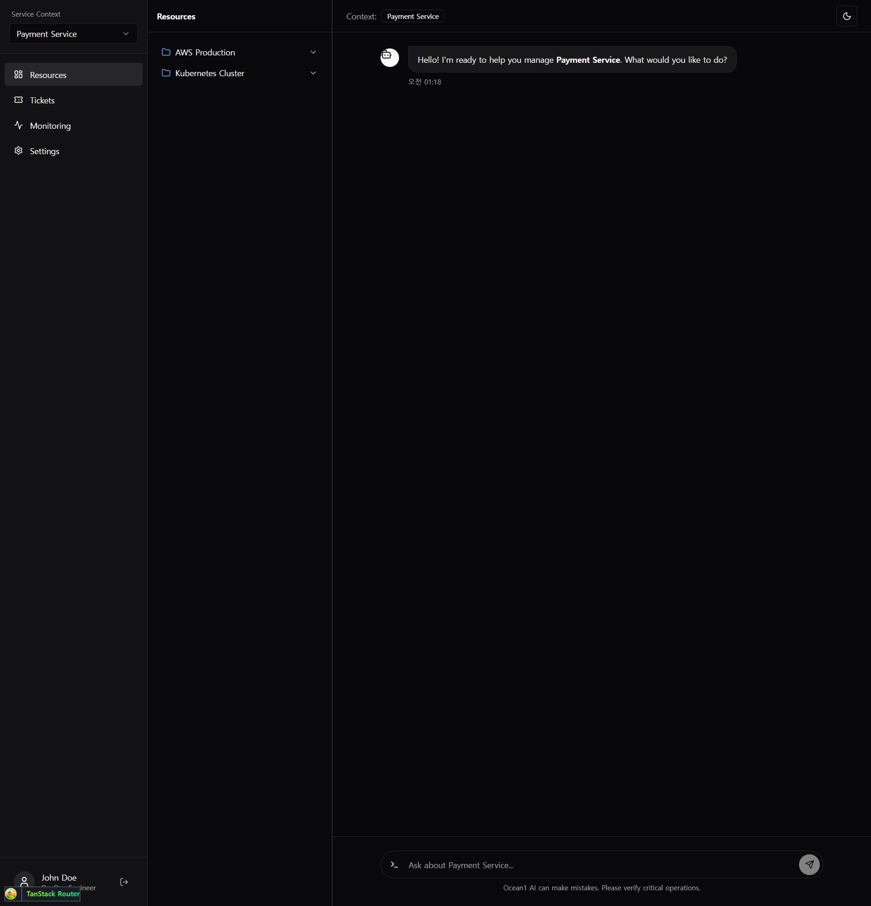
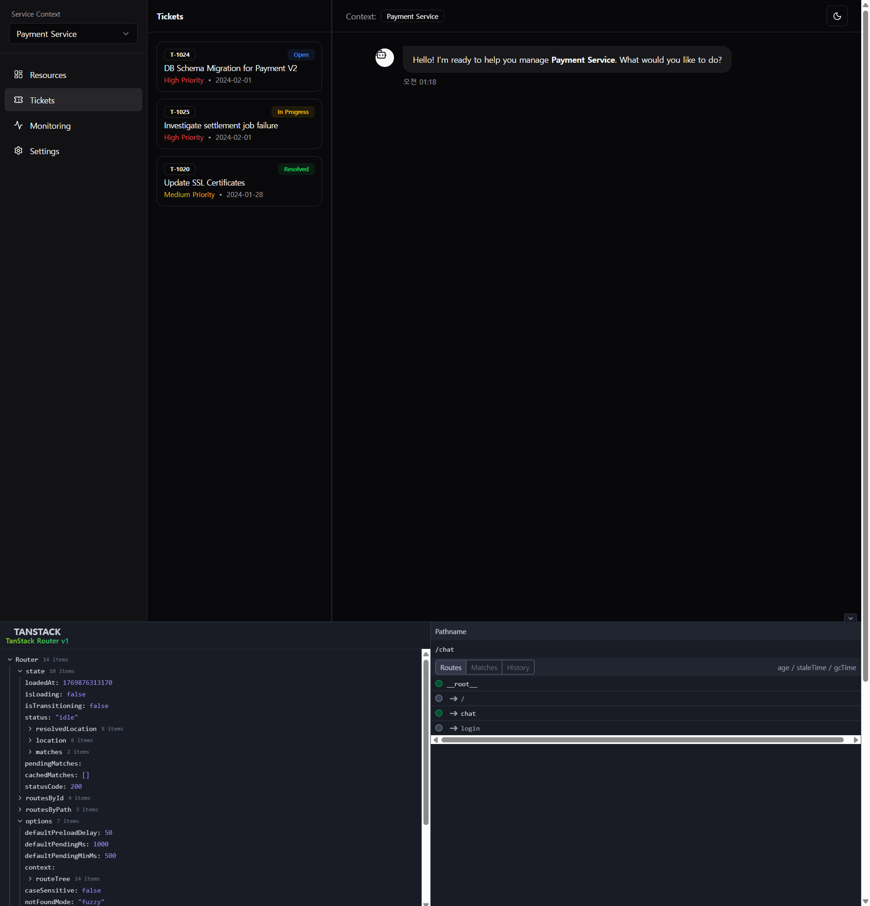
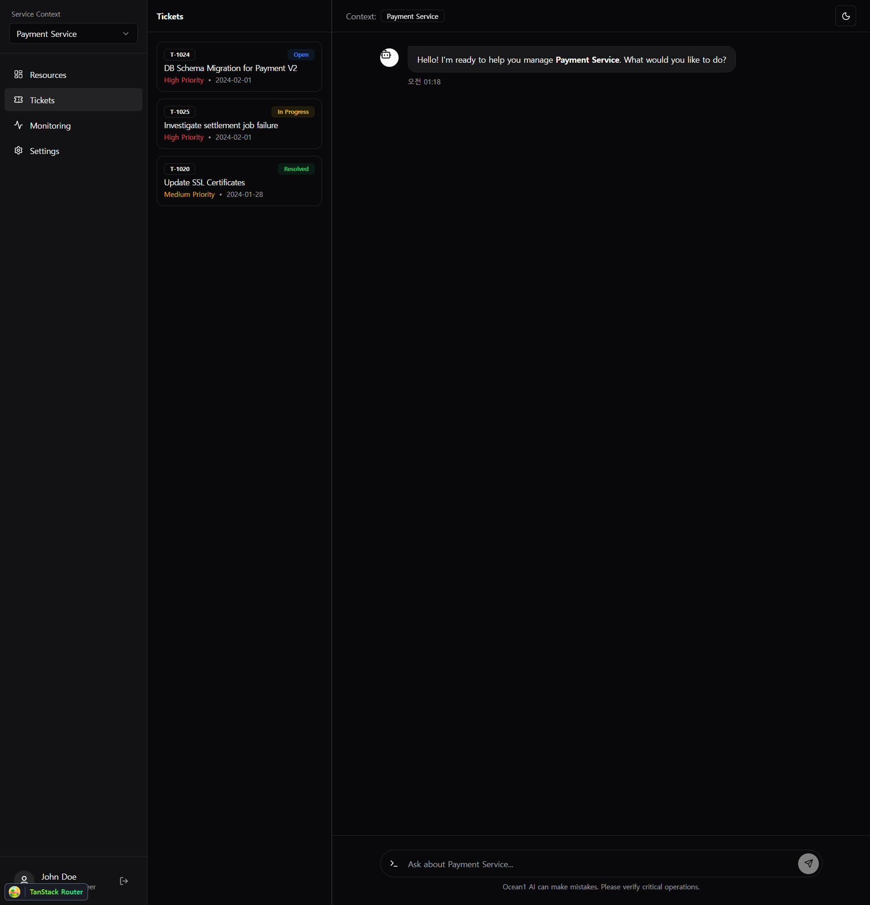
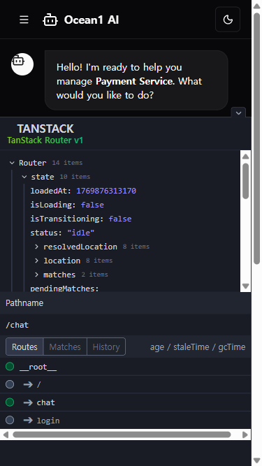

# 개발 일지 - 2026년 2월 1일 (v2)

## 🛠 UI 고도화: 서비스 컨텍스트 및 리소스 관리

초기 프로토타입에서 한 단계 더 나아가, 실제 운영 업무에 적합한 **다중 서비스 관리 UI**로 고도화했습니다.
단순 채팅창을 넘어, 서비스별 리소스와 티켓을 한눈에 파악하고 관리할 수 있는 대시보드 형태로 진화했습니다.

### ✨ 주요 변경 사항 (Key Changes)

#### 1. 2단 사이드바 구조 (Dual Sidebar Layout)
복잡한 정보를 효율적으로 보여주기 위해 사이드바를 **Primary**와 **Secondary**로 분리했습니다.

*   **Primary Sidebar**: 서비스 선택, 대메뉴(Resources, Tickets 등), 사용자 프로필
*   **Secondary Panel**: 선택된 메뉴의 상세 콘텐츠 (트리뷰, 리스트)

#### 2. 서비스 컨텍스트 스위칭 (Service Context Switching)
사용자가 관리하는 여러 서비스(Payment, Auth, Inventory)를 드롭다운으로 쉽게 전환할 수 있습니다.
서비스를 변경하면 채팅 컨텍스트와 리소스 트리가 해당 서비스에 맞춰 자동으로 업데이트됩니다.

#### 3. 리소스 탐색기 및 티켓 관리 (Resources & Tickets)
*   **Resource Explorer**: AWS, K8s 등 인프라 자원을 계층형 트리(Accordion)로 시각화했습니다. 상태 아이콘(🟢/🔴)으로 자원 상태를 직관적으로 보여줍니다.
*   **Ticket Manager**: 현재 진행 중인 작업 티켓을 우선순위/상태 배지와 함께 리스트로 제공합니다.

#### 4. 모바일 반응형 지원 (Mobile Responsiveness)
모바일 환경에서도 햄버거 메뉴를 통해 2단 사이드바에 접근할 수 있도록 `Sheet` 컴포넌트를 활용하여 Drawer UI를 구현했습니다.

---

## 💻 기술적 구현 (Technical Details)

*   **Layout Composition**: `ChatPage` 내에서 `PrimarySidebar`와 `SecondaryPanel`을 조합하여 레이아웃을 구성.
*   **State Management**: `selectedService`와 `activeMenu` 상태를 상위 컴포넌트로 끌어올려(Lifting State Up) 사이드바와 메인 콘텐츠 간의 동기화 구현.
*   **Mock Data Strategy**: `mockServices`, `mockResources`, `mockTickets` 등 정적 데이터를 분리하여 향후 API 연동이 용이하도록 설계.

## 📝 다음 단계 (Next Steps)
*   **Drag & Drop**: 리소스 트리에서 자원을 채팅창으로 드래그하여 컨텍스트 주입 기능 구현.
*   **Real Backend**: Mock Data를 실제 백엔드 API로 교체.
*   **Ticket Detail View**: 티켓 클릭 시 우측 패널에 상세 정보 표시.
