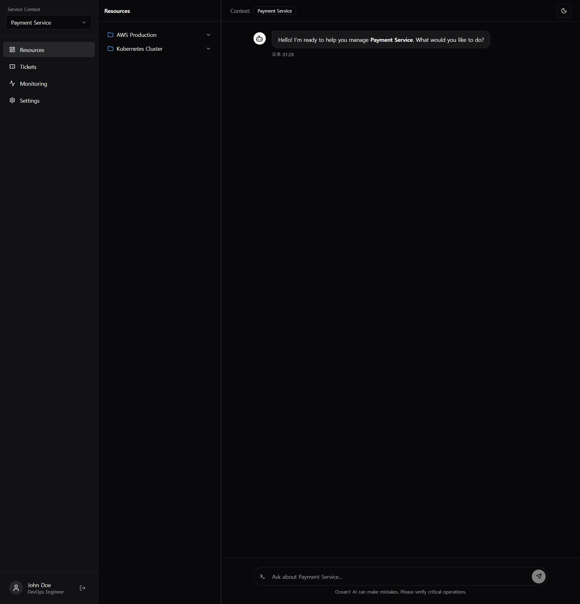

# 개발 일지 - 2026년 2월 1일 (v3)

## 🐛 버그 수정: 아바타 아이콘 정렬 문제

채팅 인터페이스에서 봇(Bot)과 사용자(User) 아바타 내부의 아이콘이 중앙에 정렬되지 않는 시각적 결함이 발견되어 수정했습니다.

### 🔍 문제 상황 (Issue)
`Avatar` 컴포넌트 내의 아이콘이 좌측 상단으로 치우쳐 렌더링되는 현상 발생.
이는 `Avatar` 컨테이너에 flexbox 정렬 속성이 누락되었기 때문입니다.

### 🛠 해결 방법 (Fix)
`chat.tsx`의 Avatar 구현부에 Tailwind 유틸리티 클래스 `flex items-center justify-center`를 추가하여 수직/수평 중앙 정렬을 강제했습니다.

```tsx
// Before
<Avatar className={cn("h-8 w-8 mt-1", ...)}>

// After
<Avatar className={cn("h-8 w-8 mt-1 flex items-center justify-center", ...)}>
```

### 📸 결과 (Result)
아이콘이 아바타 원형 컨테이너의 정중앙에 위치하게 되었습니다.


