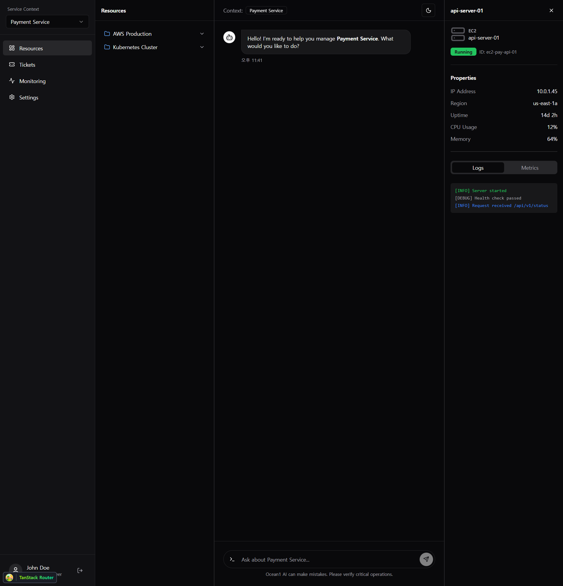
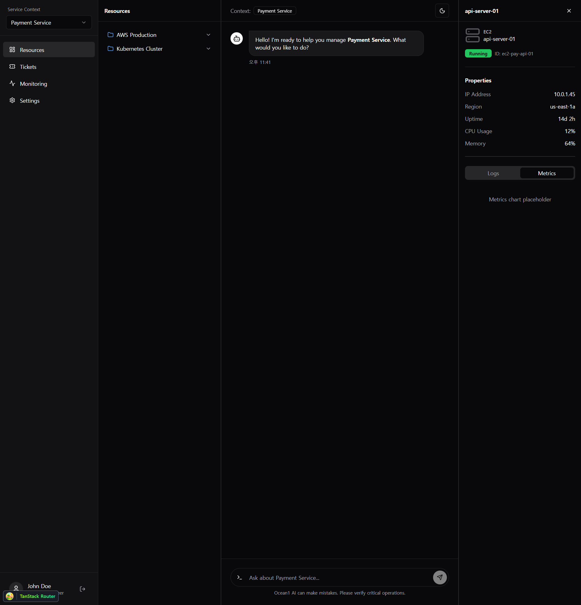
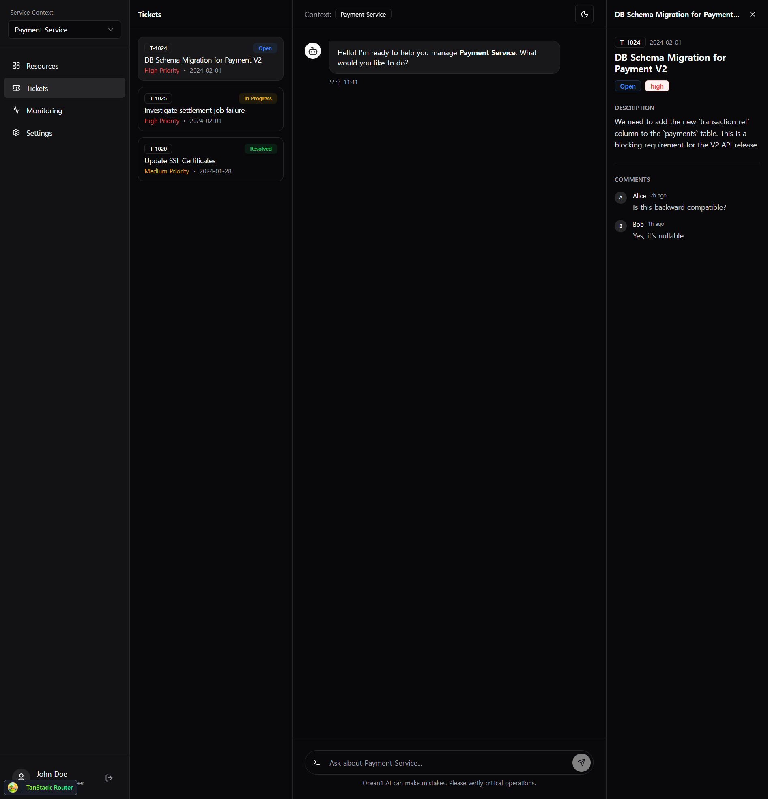

# 2026-02-01 (v4): 상세내용 패널 추가

## Summary
- **우측 상세내용 패널(Detail Panel)** 구현
- 리소스(Resource)와 티켓(Ticket) 상세 정보 표시 기능 추가
- Tabs 컴포넌트를 활용한 Logs/Metrics 뷰 구현

## Files Changed
- `apps/web/src/components/layout/detail-panel.tsx` - 상세내용 패널 컴포넌트 신규 생성
- `apps/web/src/routes/chat.tsx` - DetailPanel 통합 및 선택 상태 관리 추가

## Screenshots

### Resource Detail Panel (with Logs tab)

*EC2 인스턴스 상세 정보: IP, Region, Uptime, CPU, Memory 및 Logs 탭*

### Resource Detail Panel (with Metrics tab)

*Metrics 탭 전환 - 차트 플레이스홀더 표시*

### Ticket Detail Panel

*티켓 상세 정보: 설명, 상태, 우선순위, 댓글 스레드*

## Notes
- 리소스 클릭 시: IP, Region, Uptime, CPU, Memory 등 인프라 정보 표시
- 티켓 클릭 시: 설명, 담당자, 댓글 스레드 표시
- Tabs를 통해 Logs와 Metrics 뷰 전환 가능
- 추후 실제 API 연동 시 mock 데이터 교체 필요
