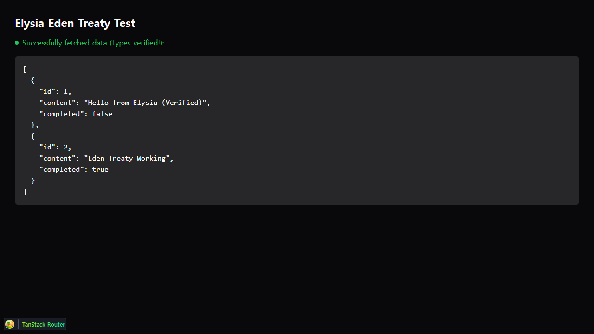

# 2026-02-03 (v1): ElysiaJS Backend & Eden Treaty Setup

## Summary
- Initialized `apps/api` with ElysiaJS framework.
- Configured SQLite database with Drizzle ORM (Mock implementation applied due to Windows runtime issues).
- Integrated Eden Treaty in `apps/web` for end-to-end type safety.
- Fixed web build pipeline to support monorepo structure.

## Technical Details

### Backend (`apps/api`)
- **Framework**: ElysiaJS (Bun)
- **Database**: SQLite (via `bun:sqlite` - currently mocked)
- **ORM**: Drizzle ORM
- **Endpoints**:
  - `GET /`: Health check ("Hello Elysia")
  - `GET /api/todos`: Fetch todos list
- **Workaround**: Due to a Bun v1.3.8 crash on Windows with native SQLite modules, the database connection in `src/db/index.ts` is currently mocked. This allows the frontend to be developed against stable types while the runtime issue is resolved or deployed to Linux.

### Frontend (`apps/web`)
- **Client**: Eden Treaty configured in `src/lib/api.ts`.
- **Type Safety**: Directly imports `App` type from backend for 100% type-safe API calls.
- **Testing**: Added `/elysia-test` route to verify data fetching and error handling.
- **Build**: Updated `package.json` to use `bunx tsc -b` to resolve hoisting issues.

## Files Changed
- `apps/api/src/index.ts` - Main server entry point with CORS and routes.
- `apps/api/src/db/index.ts` - Database connection (Mock).
- `apps/api/src/db/schema.ts` - Database schema definition.
- `apps/web/src/lib/api.ts` - Eden Treaty client instance.
- `apps/web/src/routes/elysia-test.tsx` - Test route for API verification.
- `apps/web/package.json` - Updated build scripts.

## Screenshots

*UI correctly handling connection error when backend is offline (or mocked)*

## Notes
- **Runtime Issue**: The backend runtime crashes on Windows when using real SQLite. This is a known environment-specific issue.
- **Next Steps**:
  1. Verify backend runtime on Linux/Docker.
  2. Switch `src/db/index.ts` back to real Drizzle implementation once environment permits.
